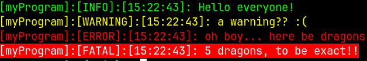
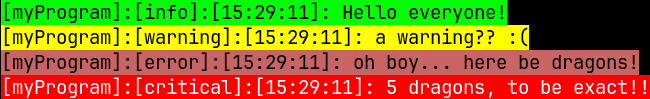

# rklog

A simple header-only logging library used for explicit logging and debugging

## Basic Examples

### Basic usage

```c
// Specify RK_LOG_IMPLEMENTATION for compilation of library
#define RKLOG_IMPLEMENTATION
#include <rklog/rklog.h>

int main(void)
{
    // Create a new logger with the title; "myProgram"
    RKLogger *const myLogger = rkDefaultLogger("myProgram");

    // Make some logs...
    rkLogInfo(myLogger, "Hello everyone!");
    rkLogWarning(myLogger, "a warning?? %s", ":(");
    rkLogError(myLogger, "oh boy... here be dragons!");
    rkLogFatal(myLogger, "%d dragons, to be exact!!", 5);

    // Release any resources used by the logger
    rkCloseLogger(myLogger);
}
```

The program above yields to the following output to `stderr`:



### Customizable styles

```c
// Specify RK_LOG_IMPLEMENTATION for compilation of library
#define RKLOG_IMPLEMENTATION
#include <rklog/rklog.h>

int main(void)
{
    // Create a custom style for our logger
    const RKLogStyle myStyle = RKLOG_STYLE(
        // Each RK_CONFIG takes in a tag, background color and foreground color
        RKLOG_CONFIG("info", RKLOG_COLOR(0, 255, 0), RKLOG_COLOR(0, 0, 0), true),
        RKLOG_CONFIG("warning", RKLOG_COLOR(255, 255, 0), RKLOG_COLOR(0, 0, 0), true),
        RKLOG_CONFIG("error", RKLOG_COLOR(200, 100, 100), RKLOG_COLOR(0, 0, 0), true),
        RKLOG_CONFIG("critical", RKLOG_COLOR(255, 0, 0), RKLOG_COLOR(255, 255, 255), true)
    );
    // Create a new logger with the title; "myProgram" and style
    RKLogger *const myLogger = rkCreateLogger("myProgram", myStyle);

    // Make some logs...
    rkLogInfo(myLogger, "Hello everyone!");
    rkLogWarning(myLogger, "a warning?? %s", ":(");
    rkLogError(myLogger, "oh boy... here be dragons!");
    rkLogFatal(myLogger, "%d dragons, to be exact!!", 5);

    // Release any resources used by the logger
    rkCloseLogger(myLogger);
}
```

The program above yields the following output to `stderr`:




## Future Plans

- Customizable logging formats
- Thread safe logging (implemented, but untested)
- More portability
- Test on MacOS